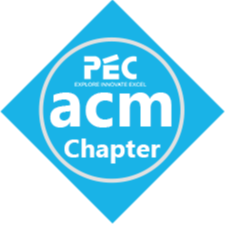

<h1 align="center">
    <b>Coding and Related Events</b>
    
</h1>

### [1. coDecode Prelims](https://www.hackerrank.com/contests/codecode-pec/challenges) 

- [Code](./coDecode_2022/Codes)
- [Editorial](./coDecode_2022/Editorial)

### [2. PCD CF #847 (Div.3)](https://codeforces.com/contest/1790) 

- [Code](./PCD_CF847_Div3/)

### [3. PCD CF #849 (Div.4)](https://codeforces.com/contest/1791)

- [Code](./PCD_CF849_Div4)

### [4. Lockout v1](https://www.hackerrank.com/contests/lockout-v1-pec-acm/challenges)

- [Problem Statement](./Lockout_v1/Problem_Statements)
- [Code](./Lockout_v1/Code/)

### [5. Lockout v2](https://www.hackerrank.com/contests/lockout-v2-pec-acm/challenges)

- [Problem Statement](./Lockout_v2/Problem_Statement/ProblemStatement.md)
